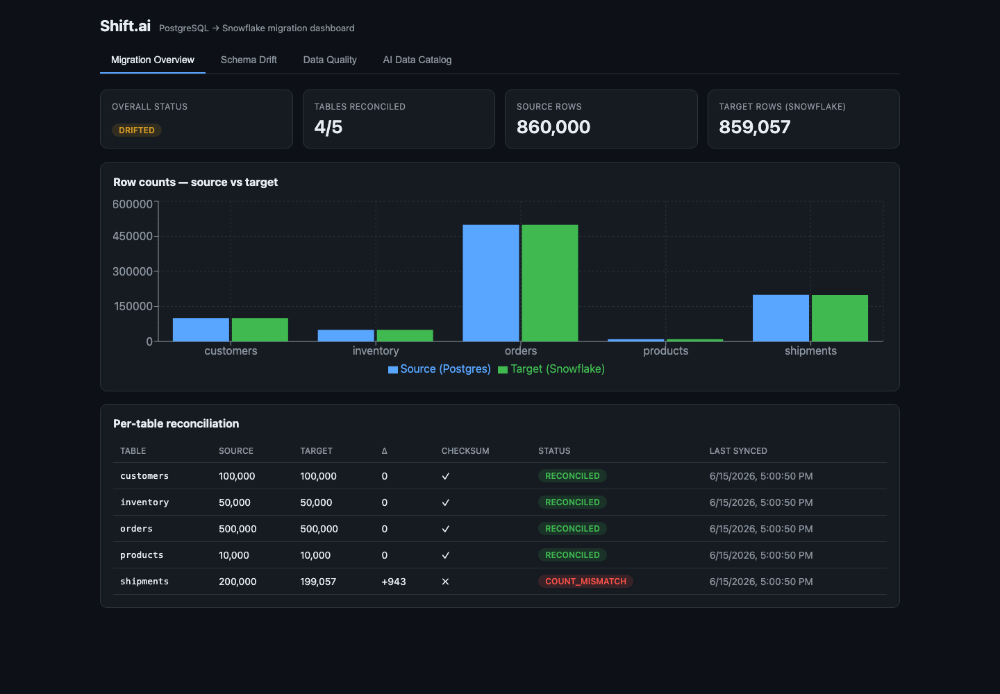
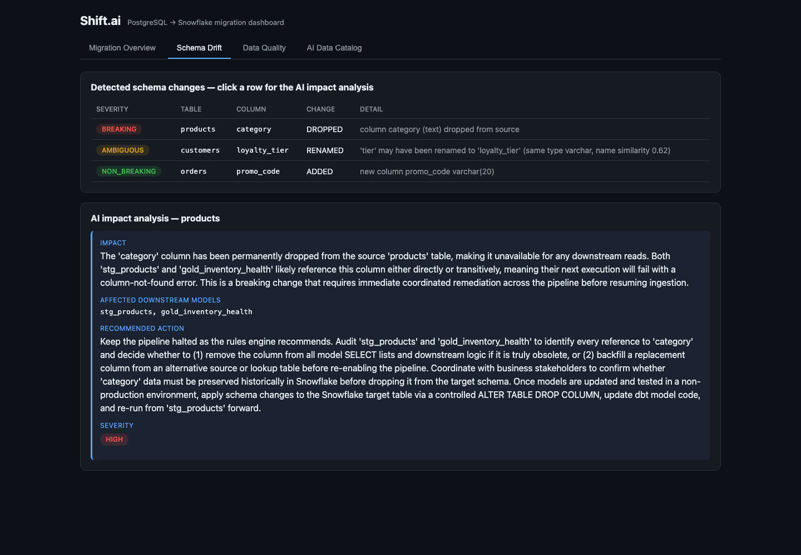
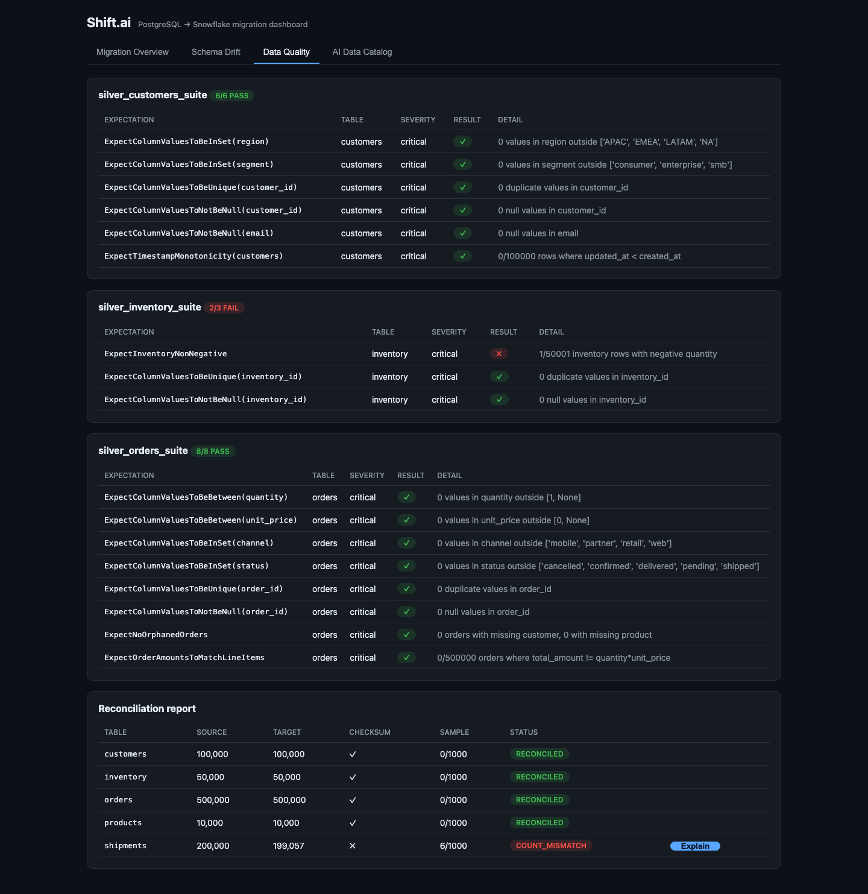
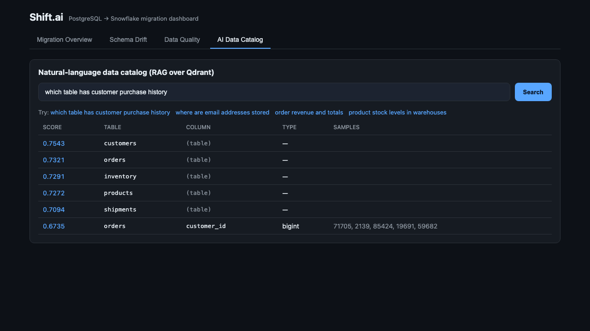

# Shift.ai — Intelligent Data Warehouse Migration Platform

> Migrate a data warehouse from **PostgreSQL → Snowflake** with Debezium CDC streaming,
> hand-written PySpark `MERGE` logic, automated data-quality validation, a reconciliation
> framework, and an AI layer that makes the migration faster and safer.

Shift.ai is an end-to-end, production-shaped data platform. The data-engineering work is
primary; the AI layer is additive. Where a tool could do something automatically, Shift.ai
writes the layer beneath it — the CDC merge, the custom expectations, the cross-engine
reconciliation checksum — so the depth is real, not glued together from defaults.

**~859K rows** migrated across 5 tables, reconciled at three levels, validated by custom
Great Expectations, transformed into Snowflake Gold marts with dbt, orchestrated by Airflow,
and surfaced through a live React dashboard with an AI data catalog and LLM-powered
schema-drift and reconciliation explanations.

---

## Architecture

```
                         REPLICATION              STREAM (Avro)
  ┌──────────────┐   ┌──────────────────┐   ┌────────────────────────┐
  │ PostgreSQL16 │──▶│   Debezium 2.5   │──▶│  Kafka 3.7 + Schema     │
  │ (WAL=logical)│   │  (pgoutput CDC)  │   │  Registry (per table)   │
  │  5 tables    │   └──────────────────┘   └───────────┬────────────┘
  └──────────────┘                                       │
        │ source of truth                                ▼  decode + dedup (LSN)
        │                                  ┌──────────────────────────────┐
        │                                  │  PySpark 3.5 — cdc_merge.py   │
        │                                  │  window dedup ▸ MERGE INTO    │
        │                                  └───────────────┬──────────────┘
        │                                                  ▼
        │                              Bronze (Delta)  ───────────▶  Silver (Delta)
        │                                                  clean + validate + quarantine
        │                                                  schema-drift detection
        │                                                          │  load
        │                                                          ▼
        │                                          ┌────────────────────────────┐
        │                                          │  Snowflake — RAW           │
        │                                          │   └ dbt ▸ staging ▸ Gold   │
        │                                          │     (4 marts)              │
        │                                          └───────────────┬────────────┘
        │                                                          │
        └───────────────── reconciliation ◀───────────────────────┘
              (row count · MD5 checksum · 1,000-row sample)
                                   │
   ┌───────────────────────────────┴───────────────────────────────────┐
   │  AI layer            │  Serving                                    │
   │  • column profiler   │  FastAPI (REST + SSE)  ──▶  React dashboard │
   │  • RAG catalog       │  Qdrant (vectors)            (4 views)      │
   │  • drift analyzer 🦾 │  Postgres (results)                         │
   │  • recon reporter 🦾 │                                             │
   └────────────────────────────────────────────────────────────────────┘
              orchestrated by Airflow 2.8 — 4 DAGs (TaskFlow API)

   🦾 = Claude (Anthropic) ·  everything except Snowflake runs in Docker Compose
```

---

## Dashboard

A React + Recharts dashboard (FastAPI backend, SSE live updates) with four views.

### Migration Overview — live reconciliation scorecard


### Schema Drift Monitor — click a change for the AI impact analysis


### Data Quality — Great Expectations suites + reconciliation report


### AI Data Catalog — natural-language search over the migrated schema


---

## The 5 deep data-engineering skills

1. **Hand-written CDC merge with exactly-once semantics** (`src/ingestion/cdc_merge.py`)
   Decodes the Confluent-Avro Debezium envelope, deduplicates within a micro-batch using a
   window function over the Postgres **LSN** (`row_number over partition by pk order by lsn desc`),
   then a single Delta `MERGE INTO` applies inserts/updates/deletes idempotently — correct under
   duplicates, out-of-order events, and replays. Proven on a live create→update→delete that
   correctly collapsed to a delete.

2. **Schema-drift detection** (`src/transformation/schema_drift.py`)
   A canonical type model classifies every change — added / dropped / widened / narrowed /
   renamed — into `NON_BREAKING` / `BREAKING` / `AMBIGUOUS`, then decides `auto_evolve` / `halt`
   / `review`. Tracked against a stored source-schema baseline to avoid false positives from
   Debezium's wire encoding.

3. **Bronze→Silver with quarantine** (`src/transformation/bronze_to_silver.py`)
   Table-specific cleaning (recalc `total_amount`, normalize segments/emails, legal shipment
   status) + Spark-native validation (null/duplicate PKs, future timestamps, type consistency).
   Bad rows are **quarantined** with their violation list, never silently dropped or allowed to
   halt the pipeline.

4. **Reconciliation framework** (`src/transformation/reconcile.py`)
   Three levels — row-count parity, an **order-independent MD5 checksum computed identically on
   both Postgres and Snowflake**, and a 1,000-row field-by-field sample diff with type-aware
   tolerance. Detected the real shipments discrepancy (200,000 vs 199,057 — the 943 quarantined
   rows).

5. **Custom Great Expectations** (`src/quality/expectations/`)
   Four custom expectations validating cross-table referential integrity and business rules:
   `ExpectOrderAmountsToMatchLineItems`, `ExpectNoOrphanedOrders` (FK), `ExpectInventoryNonNegative`,
   `ExpectTimestampMonotonicity`. Results persisted to Postgres for the dashboard.

## The 4 AI features

1. **Column profiler** (`src/quality/profiler.py`) — pure statistics (null rate, cardinality,
   min/max/mean, samples) for all 36 columns → `catalog.column_profiles`.
2. **RAG data catalog** (`src/ai/catalog.py`) — fastembed (bge-small) embeddings in Qdrant;
   "where are email addresses stored" → `customers.email`.
3. **LLM schema-drift analyzer** (`src/ai/drift_analyzer.py`) — Claude explains a breaking change's
   impact, the affected dbt models, and a migration strategy (cached by drift pattern).
4. **AI reconciliation reporter** (`src/ai/reconciliation_reporter.py`) — Claude explains a
   reconciliation discrepancy in plain English with probable root cause and next steps.

LLM calls go through a single provider-agnostic client (`src/ai/llm_client.py`).

---

## Tech stack

PostgreSQL 16 · Debezium 2.5 · Apache Kafka 3.7 + Confluent Schema Registry (Avro) ·
PySpark 3.5 + Delta Lake 3.0 · Snowflake · dbt Core 1.8 · Great Expectations-style suites ·
Apache Airflow 2.8 · Qdrant · fastembed · Anthropic Claude · FastAPI + SSE · React + Recharts ·
Docker Compose (full local stack except Snowflake).

## Quick start

```bash
make venv        # local .venv for host tooling (seed, peek, reconcile demos)
make setup       # bring up the stack + seed Postgres (~860K rows) + register Debezium
make peek-orders # watch raw CDC events decode (the Phase-1 depth checkpoint)

make dashboard   # FastAPI + React → http://localhost:5173
make airflow     # Airflow scheduler + webserver → http://localhost:8080 (admin/admin)
```

Demo flow (each maps to a real subsystem):

```bash
make migrate            # stream CDC → Bronze, promote → Silver
make drift              # schema-drift detection (rolled-back DDL; source untouched)
make chaos              # inject bad data → trips a Great Expectations failure
make gold               # load Silver → Snowflake RAW + build dbt Gold marts
make reconcile          # source ↔ target: count / checksum / 1,000-row sample
make catalog Q="which table has order revenue"   # natural-language catalog search
make explain-recon      # Claude explains the reconciliation discrepancies
make explain-drift      # Claude explains a breaking schema change
make test               # 55 unit tests (PySpark + pure logic)
```

Run `make help` for the full target list.

## Repository layout

```
infra/                 Dockerfiles + Postgres config/DDL (postgres, debezium, spark, dbt, api, airflow, snowflake keys)
src/
  ingestion/           debezium_config.json, cdc_merge.py  ← the most important file
  transformation/      bronze_to_silver.py, schema_drift.py, reconcile.py, load_snowflake.py
  quality/             expectations/ (4 custom + suites + runner), profiler.py
  ai/                  llm_client.py, embeddings.py, catalog.py, drift_analyzer.py, reconciliation_reporter.py
  api/                 FastAPI app (REST + SSE)
  orchestration/dags/  4 Airflow DAGs (TaskFlow API)
  common/              shared table registry
dbt/                   staging views + Gold marts (incl. gold_migration_summary)
ui/                    React + Vite + Recharts dashboard
scripts/               seed_postgres.py, peek_topic.py, demo_* drivers
tests/                 55 unit tests
docs/screenshots/      dashboard captures
```

## Status — all 10 phases complete

| Phase | What | Verified |
|------:|------|----------|
| 0 | Infra + 860K-row seed | ✅ live |
| 1 | Debezium CDC + Avro | ✅ c/u/d/tombstone decoded |
| 2 | `cdc_merge.py` (idempotent MERGE) | ✅ 8 tests + 10K live to Bronze |
| 3 | Schema-drift detection | ✅ 10 tests + live demo |
| 4 | Bronze→Silver + quarantine | ✅ 12 tests + 859K promoted |
| 5 | Custom Great Expectations | ✅ 8 tests + all suites pass live |
| 6 | dbt Gold on Snowflake | ✅ 8 models built live |
| 7 | Reconciliation framework | ✅ 9 tests + live source↔target |
| 8 | Airflow (4 DAGs) | ✅ parse clean + cdc_ingest ran green |
| 9 | AI layer | ✅ 8 tests + catalog/profiler/Claude reporters live |
| 10 | FastAPI + React dashboard | ✅ 4 views verified in-browser |

**55 unit tests green.** Every phase validated live, not just compiled.

## Key metrics

- Migrated **650K+ rows** (859K total) across 5 tables from PostgreSQL to Snowflake using
  Debezium CDC with hand-written PySpark `MERGE` handling insert/update/delete with idempotent,
  exactly-once semantics.
- Built a reconciliation framework validating row-count parity, cross-engine MD5 checksums, and
  1,000-row sample comparison across source and target.
- Detected breaking schema changes (drops, type narrowing) in real time, halting the migration
  automatically to prevent data loss.
- Implemented 4 custom Great Expectations validating cross-table referential integrity and
  business rules.
- Built a RAG-powered data catalog over Qdrant for natural-language column discovery across 36
  columns.

## Configuration

Everything is env-driven — zero hardcoded credentials. Copy `.env.example` to `.env`
(`make env`) and fill in Snowflake + Anthropic keys. Snowflake uses key-pair auth
(`infra/snowflake/`) for MFA-enforced trial accounts.
